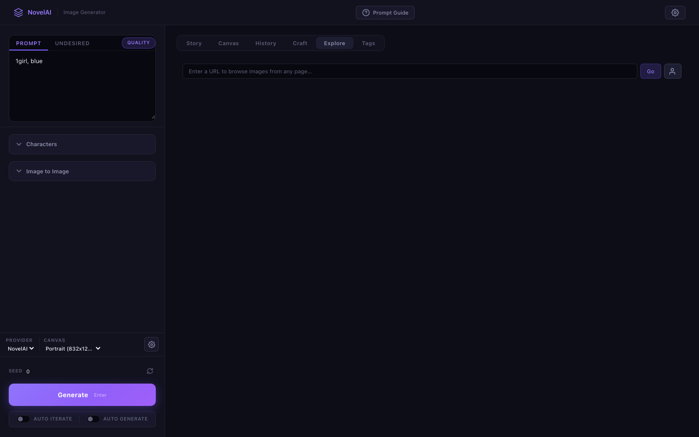

# NovelAI Image Generator

A power-user frontend for [NovelAI](https://novelai.net/) and [xAI Grok](https://x.ai/) image generation APIs. Built because their official UIs are designed for casual users — not for someone generating 50+ images a day who needs to iterate without friction.

> **You type tags. You hit generate. You stare at the result. You tweak one word. You hit generate again.**
>
> This is the loop. Hundreds of times a day. Every click, every wait, every blank text box where autocomplete should be — that's friction. This app removes it.


---

## 30 Seconds to Running

```bash
git clone https://github.com/j129008/novelai.git && cd novelai
cp .env.example .env
pip install -r backend/requirements.txt
python backend/main.py        # → http://localhost:8000
```

Edit `.env` and add your API keys:

```env
NOVELAI_TOKEN=your_novelai_token    # Required — get from NovelAI → Account Settings → API Token
XAI_API_KEY=your_xai_api_key       # Optional — enables Grok image/video generation
```

No `npm install`. No webpack. No Docker. One Python process serves everything.

> **NovelAI** requires an active subscription (Opus/Tablet/Scroll). **Grok** — sign up at [console.x.ai](https://console.x.ai). Only needed if you want Grok features.

---

## What It Does

### Tag autocomplete against 400k entries

NovelAI's model understands ~400k tags. The official UI gives you a blank text box.

This app gives you **autocomplete against the full tag database** — with aliases, categories, and usage counts. You also get a **Tag Browser** to explore tags by category (hair, eyes, clothing, poses, expressions...) instead of guessing vocabulary from memory.


### Reverse-engineer what made an image work

You generated something great but you're not sure which tags mattered. Was it `dramatic lighting` or `rim light`?

**Prompt Autopsy** — drop any image in, and WD Tagger v3 runs locally (ONNX, no cloud dependency) to extract the tags the model sees. Reverse-engineer compositions you love, then steal those tags for your next prompt.

**Prompt DNA** — paste your current prompt and get suggestions you haven't tried yet:
- **Boosters** — tags that frequently co-occur with yours (proven combos)
- **Contrasts** — tags from a different direction (break out of creative ruts)
- **Wildcards** — random picks for happy accidents

### Compare variations systematically, not one at a time

**Variation Dial** — pick a dimension (lighting / art style / composition / mood), hit one button, get 4 systematic variants side by side. Instead of "would neon lighting look good?" you just *see* warm vs dramatic vs neon vs moonlit in one grid.


### Place multiple characters exactly where you want them

The NovelAI API supports multi-character composition with per-character prompts and spatial coordinates. The official UI barely exposes this.

Here you get a **visual 2D canvas** — click where each character goes, write individual prompts, define their interaction. Up to 5 characters. Recently used character presets are remembered across sessions.


### Find that one good image from 200 you generated today

Every generation auto-saves with **full metadata baked into the PNG** — prompt, negative prompt, seed, sampler, steps, all of it. The built-in gallery lets you browse, organize into folders, and **click any image to reload its exact parameters**. One click to resume iteration on anything from any session.


### Use any web image as a reference without leaving the app

**Image Explorer** — paste a URL and see every image on that page. Click one. It's now your img2img source. The app handles proxying, format conversion, and aspect ratio cropping with built-in pan/zoom tools.

Or **Cmd+V** a clipboard image directly.



### Switch between NovelAI and Grok with one click

Same prompt field, same gallery, same workflow. Grok adds:
- Image generation and image editing (modify existing images with text)
- **Video generation** (5–15s clips) with real-time progress streaming
- Live **cost dashboard** — know exactly what you're spending

---

## Technical Notes

```
browser ──→ FastAPI backend ──→ NovelAI API
                │                 Grok API
                │
                ├── Tag DB (400k tags, co-occurrence graph)
                ├── WD Tagger v3 (ONNX, runs locally)
                └── Gallery (PNG files with metadata embedded)
```

**API tokens never touch the browser.** The backend is a secure proxy — all API calls, image processing, and web scraping happen server-side.

The frontend is ~5.4k lines of vanilla JavaScript with zero dependencies. Deliberate choice: the app starts instantly, deploys anywhere Python runs, and the entire client-side codebase is a single file you can read top to bottom.

| Layer | Tech |
|-------|------|
| Server | Python 3.11+, FastAPI, Uvicorn, fully async |
| HTTP | httpx |
| Image analysis | ONNX Runtime (WD Tagger v3), Pillow |
| Frontend | Vanilla JS/CSS, zero build step |
| Data | 400k-tag CSV, curated co-occurrence graph |

```
backend/
├── main.py                 # Entry point — serves frontend + API
├── api/
│   ├── routes.py           # 30+ API endpoints
│   ├── novelai.py          # NovelAI API client
│   ├── grok.py             # Grok/xAI client (image + video)
│   └── tagger.py           # WD Tagger v3 (ONNX inference)
├── models/schemas.py       # Pydantic models
└── data/
    ├── tags.csv            # 400k tags with categories & aliases
    ├── tag_categories.json # Curated browsing hierarchy
    └── tag_cooccurrence.json

frontend/
├── index.html
├── js/app.js               # All frontend logic (~5.4k lines)
└── css/style.css           # Design system + components
```

---

## Docs

- [User Guide](docs/user-guide.md) — full feature walkthrough with usage tips
- [API Reference](docs/api-reference.md) — all 30+ endpoints documented

MIT License
