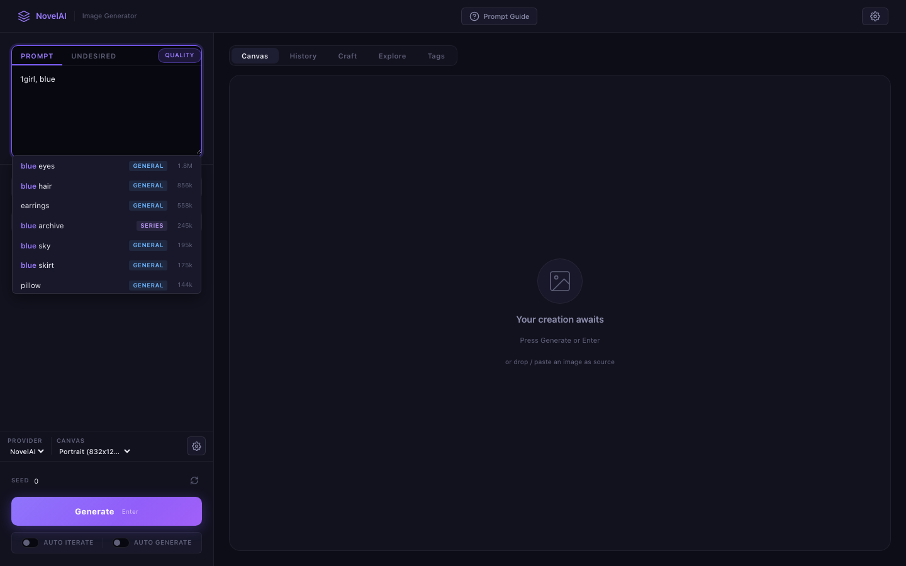
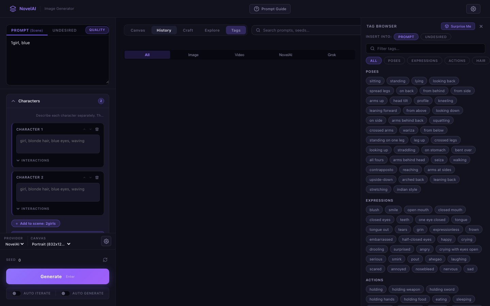
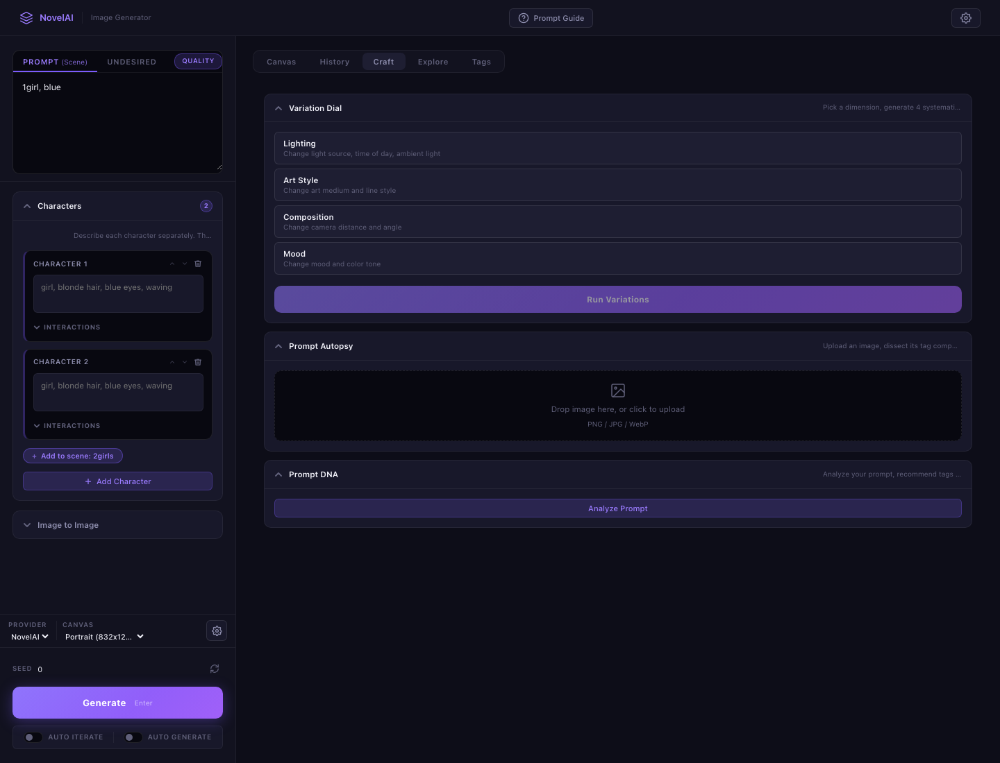
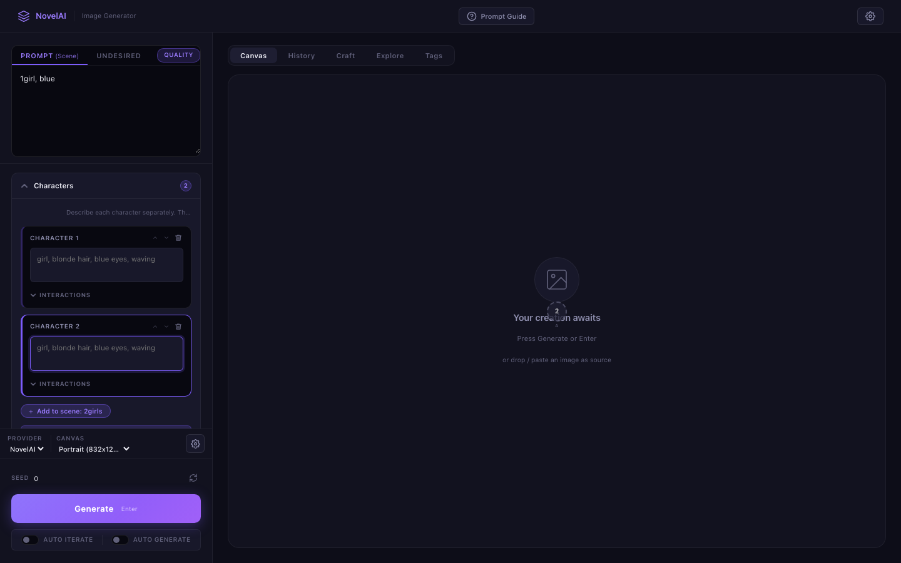
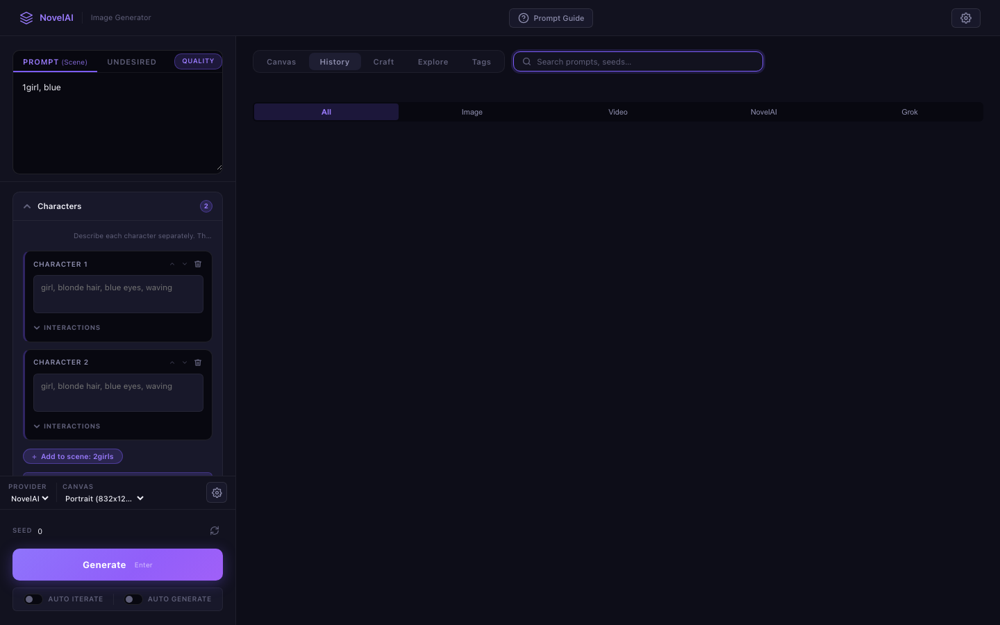

# NovelAI Image Generator

> **You type tags. You hit generate. You stare at the result. You tweak one word. You hit generate again.**
>
> This is the loop. Hundreds of times a day. And every single step has friction.

This project exists because I got mass-generating AI illustrations and got tired of fighting the tools instead of making art.

NovelAI has one of the best anime diffusion models on the market. But its web UI is built for casual users — not for someone who generates 50+ images a day and needs to iterate fast. So I built the interface I actually wanted.

## 30 Seconds to Running

```bash
git clone https://github.com/j129008/novelai.git && cd novelai
cp .env.example .env          # paste your NovelAI token
pip install -r backend/requirements.txt
python backend/main.py        # → http://localhost:8000
```

That's it. No `npm install`. No webpack. No Docker. One Python process serves everything.


---

## Why This Exists

### "What tags does this model even know?"

NovelAI's model understands ~400k tags. The official UI gives you a blank text box.

This app gives you **autocomplete against the full tag database** — with aliases, categories, and usage counts. You also get a **Tag Browser** that lets you explore tags by category (hair, eyes, clothing, poses, expressions...) instead of guessing vocabulary from memory.





### "I like this image. What made it work?"

You generated something great, but you're not sure which tags actually mattered. Was it `dramatic lighting` or `rim light`? Was it `dynamic angle` or `from below`?

**Prompt Autopsy** — drop any image in, and WD Tagger v3 runs locally (ONNX, no cloud dependency) to extract the tags the model sees. Reverse-engineer what makes a composition work, then steal those tags for your next prompt.

**Prompt DNA** — paste your current prompt and get suggestions you haven't tried. Three channels:
- **Boosters** — tags that frequently co-occur with yours (proven combos)
- **Contrasts** — tags from a different direction (break out of your rut)
- **Wildcards** — random picks for happy accidents

### "I want to compare lighting styles, not generate one at a time"

**Variation Dial** — pick a dimension (lighting / art style / composition / mood), hit one button, get 4 systematic variants side by side. Instead of "hmm, would neon lighting look good?" you just *see* warm vs dramatic vs neon vs moonlit in one grid.



### "Positioning two characters is impossible"

The NovelAI API supports multi-character composition with per-character prompts and spatial coordinates. The official UI barely exposes it.

Here you get a **visual 2D canvas** — click where each character goes, write individual prompts, define their interaction ("holding hands", "back to back"). Up to 5 characters. Recently used characters are remembered across sessions.



### "I generated 200 images today. Where did that good one go?"

Every generation auto-saves with **full metadata baked into the PNG** — prompt, negative prompt, seed, sampler, steps, all of it. The built-in gallery lets you browse, organize into folders, and — critically — **click any image to reload its exact parameters**. See something from 3 days ago you want to iterate on? One click.



### "I want to use this web image as a reference, but..."

The usual flow: right-click save, maybe convert format, open your tool, upload, crop to the right aspect ratio...

**Image Explorer** — paste a URL, see all images on that page, click one. It's now your img2img source. Done. The app handles proxying, format conversion, and aspect ratio cropping with built-in pan/zoom tools.

Or just **Cmd+V** an image from your clipboard.

### "I also use Grok for some styles"

Switch between **NovelAI** and **xAI Grok** with one click. Same prompt field, same gallery, same workflow. Grok adds:
- Image generation with aspect ratio / resolution control
- Image editing mode (modify existing images with text)
- **Video generation** (5–15s) with real-time progress streaming
- Live **cost dashboard** so you know exactly what you're spending

---

## Architecture

```
browser ──→ FastAPI backend ──→ NovelAI API
                │                 Grok API
                │
                ├── Tag DB (400k tags, co-occurrence graph)
                ├── WD Tagger v3 (ONNX, downloaded on first use)
                └── Gallery (PNG files with embedded metadata)
```

**Your API tokens never touch the browser.** The backend is a secure proxy — all API calls, image processing, and web scraping happen server-side.

The frontend is ~5.4k lines of vanilla JavaScript. No React, no Vue, no build step. This is a deliberate choice: the app starts instantly, deploys anywhere Python runs, and the entire client-side codebase is in one file you can read top to bottom.

| Layer | Tech |
|-------|------|
| Server | Python, FastAPI, Uvicorn, async throughout |
| HTTP | httpx |
| Image analysis | ONNX Runtime (WD Tagger v3), Pillow |
| Frontend | Vanilla JS / CSS, zero dependencies |
| Data | 400k-tag CSV, curated co-occurrence graph |

## Project Structure

```
backend/
├── main.py                 # Entry point — serves frontend + API
├── api/
│   ├── routes.py           # 30+ API endpoints
│   ├── novelai.py          # NovelAI API client
│   ├── grok.py             # Grok/xAI client (image + video)
│   └── tagger.py           # WD Tagger v3 (ONNX inference)
├── models/schemas.py       # Pydantic models
└── data/
    ├── tags.csv            # 400k tags with categories & aliases
    ├── tag_categories.json # Curated browsing hierarchy
    └── tag_cooccurrence.json

frontend/
├── index.html
├── js/app.js               # All frontend logic
└── css/style.css           # Design system + components
```

## Requirements

- Python 3.11+
- A NovelAI subscription with API access
- (Optional) xAI API key for Grok features

## Docs

- [User Guide](docs/user-guide.md) — feature walkthrough with usage tips
- [API Reference](docs/api-reference.md) — all 30+ endpoints documented

## License

MIT
