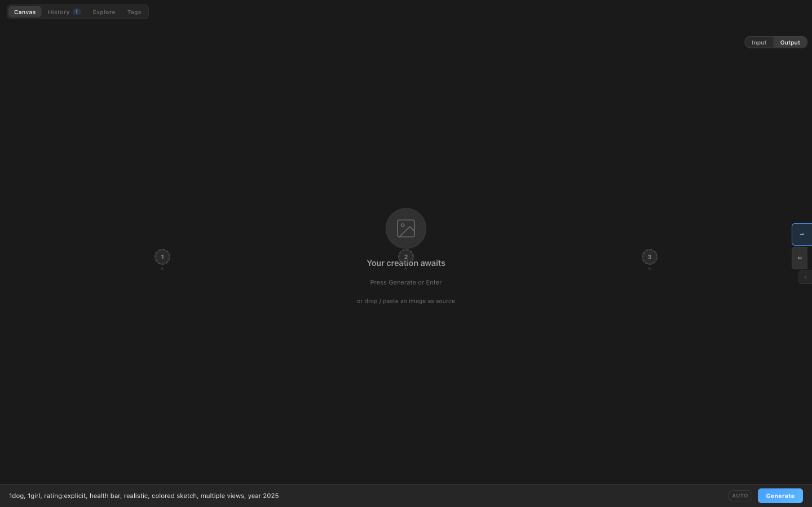
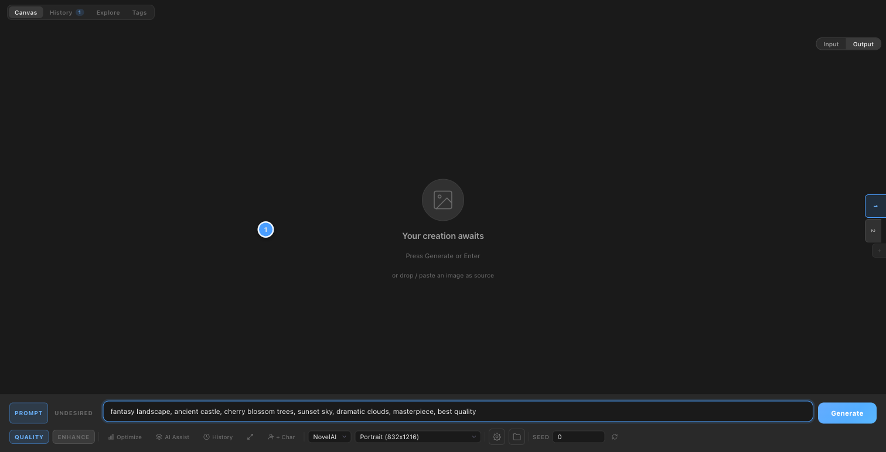
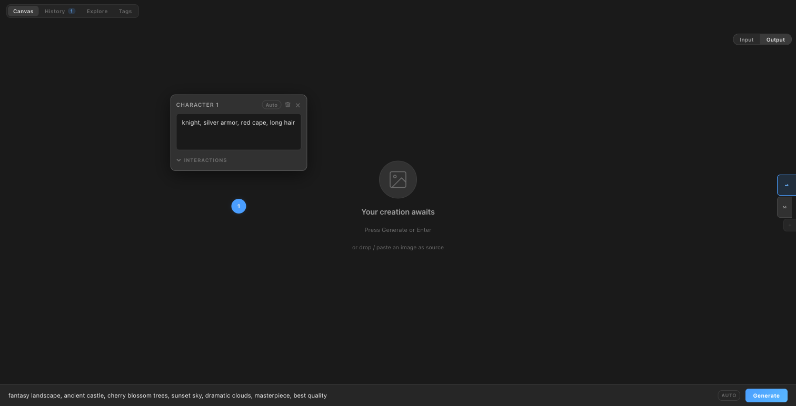
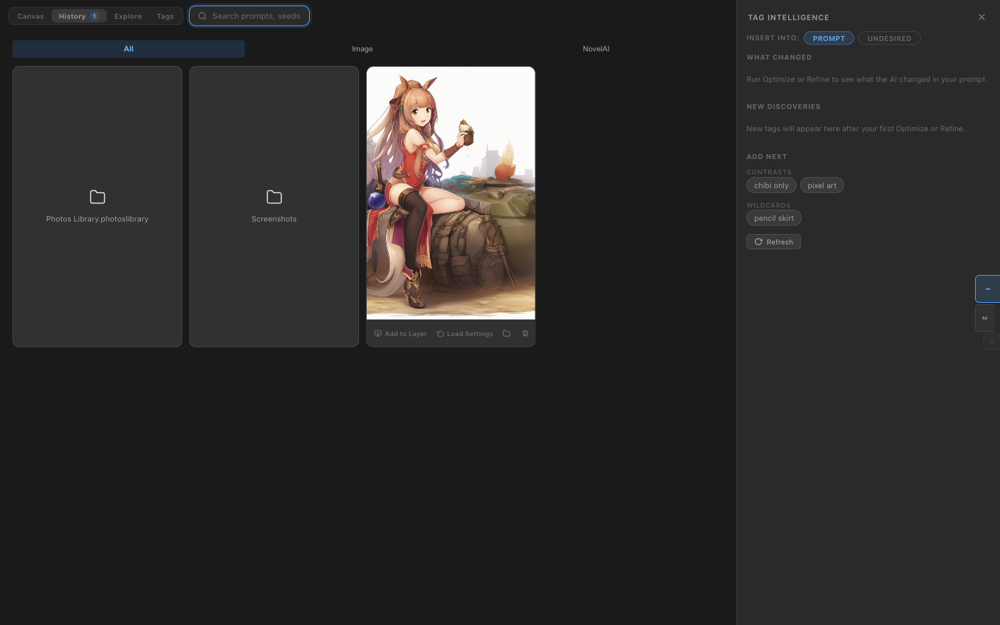
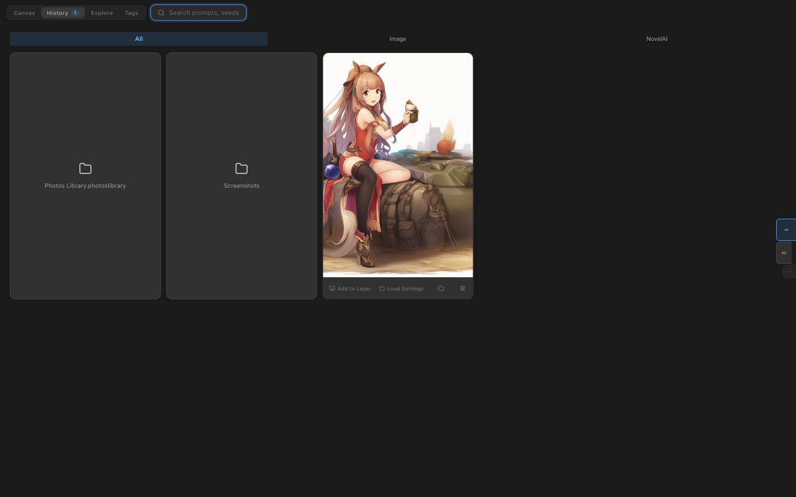
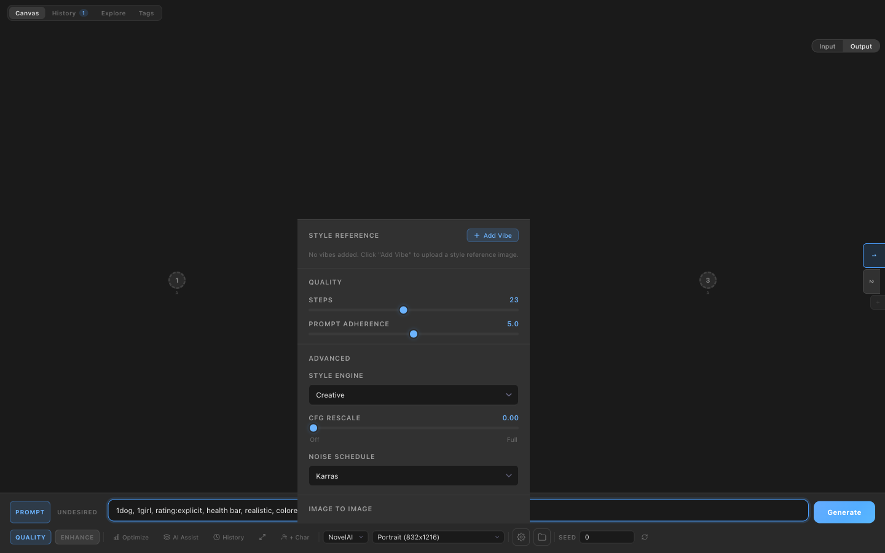

# NovelAI Image Generator

A power-user frontend for [NovelAI](https://novelai.net/) and [xAI Grok](https://x.ai/) image generation APIs. Canvas-centric UI designed to feel like a drawing tool, not a form.

> **You type tags. You hit generate. You stare at the result. You tweak one word. You hit generate again.**
>
> This is the loop. Hundreds of times a day. Every click, every wait, every blank text box where autocomplete should be — that's friction. This app removes it.



---

## 30 Seconds to Running

```bash
git clone https://github.com/j129008/novelai.git && cd novelai
cp .env.example .env
pip install -r backend/requirements.txt
python backend/main.py        # -> http://localhost:8000
```

Edit `.env` and add your API keys:

```env
NOVELAI_TOKEN=your_novelai_token    # Required - get from NovelAI Account Settings
XAI_API_KEY=your_xai_api_key       # Optional - enables Grok image/video generation
```

No `npm install`. No webpack. No Docker. One Python process serves everything.

---

## Canvas-Centric UI

The entire screen is your canvas. No sidebar. All controls float on top with glass blur and auto-hide when not needed.

```
+-------------------------------------------------+
| [Canvas][History][Explore][Tags]                 |  <- floating tab bar
|                                            [L1] |
|         [  generated image  ]              [L2] |  <- layer tabs
|         [  fills everything ]              [+]  |
|                                                 |
|              (1)  (2)                           |  <- character markers
|                                                 |
| prompt text... Seed:xxx [Refine][Layer] [Gen]   |  <- collapsed prompt bar
+-------------------------------------------------+
```

### Prompt Bar



- **Collapsed**: one-line preview + Seed + Refine + Layer + Auto + Generate
- **Expanded**: click to open full editor with PROMPT/UNDESIRED tabs, Quality/Enhance toggles, Optimize, AI Assist, History, provider/resolution selects, settings gear, seed control
- **Auto-collapse**: bar collapses automatically after generation completes
- **Cmd+Enter**: generate from anywhere, even when bar is collapsed

### AI-Powered Prompt Optimization

Click **Optimize** to have Grok reorder, fix, and enhance your tags following NovelAI V4.5 best practices:
- Reorders tags: Count -> Rating -> Character -> Appearance -> Action -> Scene -> Style
- Multi-character prompts: splits into rich base section (8+ atmospheric tags) + per-character sections
- **Enhance mode**: toggle on to append atmospheric prose fragments for stronger storytelling

Changes are tracked in the **Tag Intelligence** panel (Tags tab) showing what was added/removed and new tag discoveries.

### Characters



- Click **+Char** to add a character marker on canvas
- Click any marker to open a **popover editor** with prompt textarea and interactions
- Drag markers to set character positions
- Auto mode distributes markers evenly (AI decides final position)
- Interactions: `source#action`, `target#action`, `mutual#action` between characters

### Layers

Paper-edge tabs on the right side of canvas:
- Click tab to select, click again to open controls (opacity, scale, visibility, tools)
- Drag tabs to reorder layers
- Tools: Move, Draw, Mask, Inpaint
- **+** button to add new layers
- **Send to Layer** after generation to build up compositions

### Tag Autocomplete

140K danbooru tags with aliases, categories, and usage counts. Autocomplete appears as you type in any prompt field. Recent character tags are prioritized.

### Tag Intelligence



The Tags tab tracks your prompt evolution:
- **What Changed**: diff of last Optimize/Refine showing added (green) and removed (red) tags
- **New Discoveries**: tags you hadn't used before that AI introduced
- **Saved Tags**: bookmark good tags for future use (fed back to Optimize as preferences)
- **Add Next**: co-occurrence suggestions (boosters, contrasts, wildcards)

### Gallery



Every generation auto-saves with full metadata in the PNG. The History tab lets you:
- Browse all generations with filters (All/Image/Video/NovelAI/Grok)
- Search by prompt text or seed
- **Load Settings**: one click to reload exact parameters from any past generation
- Two-click delete confirmation
- Folder organization with drag-to-move
- Lightbox with slideshow mode

### Generation Settings



Click the gear icon to access:
- **Style Reference**: upload vibe images to guide style
- **Quality**: Steps and Prompt Adherence sliders
- **Advanced**: Style Engine, CFG Rescale, Noise Schedule
- **Auto-Critique**: toggle for AI art director feedback (opt-in)
- **Image to Image**: Transformation and Variation sliders

### Dual Provider Support

Switch between NovelAI (anime) and Grok (realistic) with one dropdown:
- **NovelAI**: danbooru tags, multi-character, layers, inpaint
- **Grok**: natural language, image editing, reference images, video generation
- Same prompt bar, same gallery, same workflow

---

## Technical Notes

```
browser --> FastAPI backend --> NovelAI API
                |                Grok API
                |
                +-- Tag DB (140K tags, co-occurrence graph)
                +-- WD Tagger v3 (ONNX, local inference)
                +-- Gallery (PNG files with embedded metadata)
```

**API tokens never touch the browser.** The backend is a secure proxy.

| Layer | Tech |
|-------|------|
| Server | Python 3.11+, FastAPI, Uvicorn, fully async |
| HTTP | httpx |
| Image processing | Pillow, NumPy, SciPy |
| Image analysis | ONNX Runtime (WD Tagger v3) |
| Frontend | Vanilla JS/CSS, zero dependencies, zero build step |
| Data | 140K-tag CSV, curated co-occurrence graph |

```
backend/
+-- main.py                 # Entry point - serves frontend + API
+-- api/
|   +-- routes.py           # 30+ API endpoints
|   +-- novelai.py          # NovelAI API client + inpaint compositing
|   +-- grok.py             # Grok/xAI client (image, video, vision, chat)
|   +-- tagger.py           # WD Tagger v3 (ONNX inference)
+-- models/schemas.py       # Pydantic models
+-- data/
    +-- tags.csv            # 140K tags with categories & aliases
    +-- tag_categories.json # Curated browsing hierarchy
    +-- tag_cooccurrence.json

frontend/
+-- index.html              # Single-page app
+-- css/style.css           # Design system (neutral gray + blue accent)
+-- js/
    +-- app.js              # Main logic, canvas prompt bar, settings
    +-- generate.js         # Generation routing (NovelAI + Grok)
    +-- characters.js       # Character markers + popover editors
    +-- layers.js           # Layer compositing + tab UI
    +-- gallery.js          # History, lightbox, load settings
    +-- tags.js             # Tag Intelligence + autocomplete
    +-- tag-intelligence.js # Optimize/refine tracking, saved tags
    +-- crop.js             # Image crop/pan for img2img
    +-- explore.js          # Image exploration tools
    +-- provider.js         # Provider switching (NovelAI/Grok)
    +-- state.js            # Global state + undo/redo
```

MIT License
